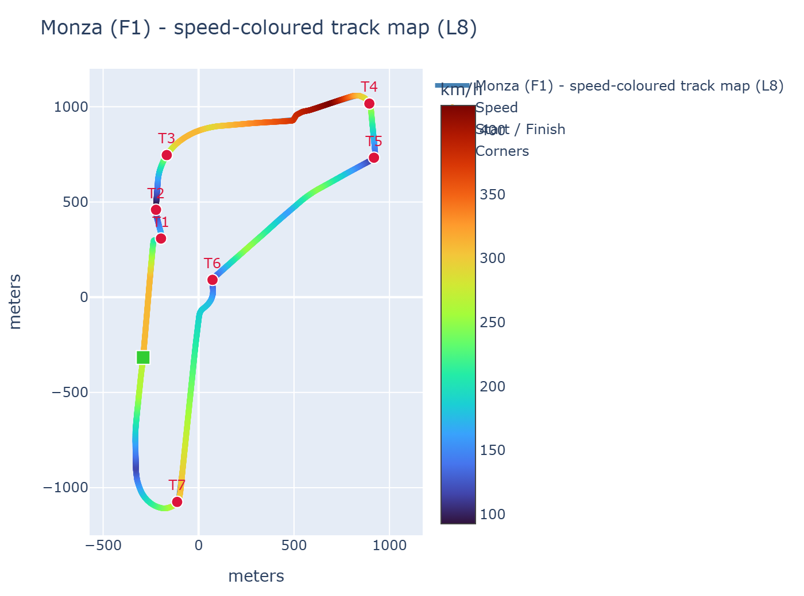
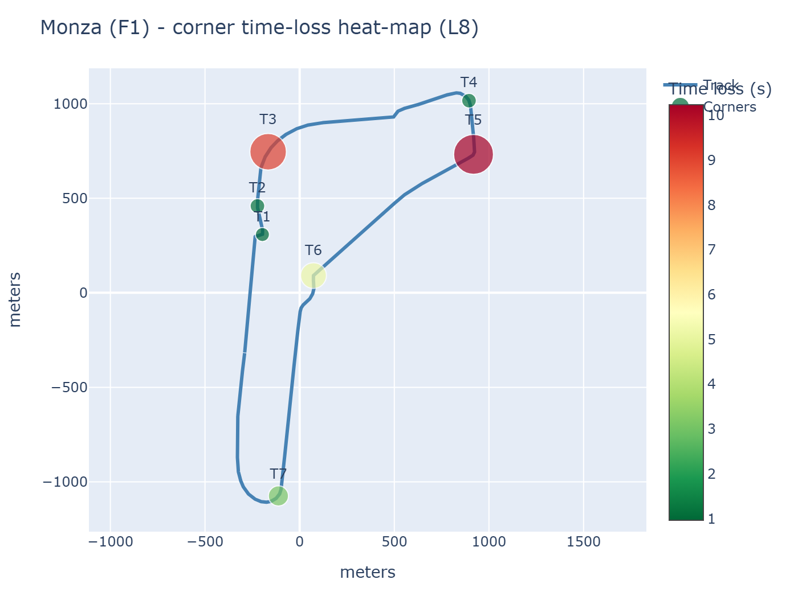

# 🏎️ PitMind — AI Driver Coach

> **A real-time AI race engineer for sim racing (ACC + F1). It analyzes driving
> telemetry, detects corner-level mistakes, estimates lost lap time, and gives a
> virtual race engineer's feedback — not just graphs.**

[](https://github.com/Daksh1308-AI-ML/PitMind/actions/workflows/ci.yml)
[](https://www.python.org/)
[](#-tests)
[](LICENSING.md)

PitMind turns raw racing telemetry into **understanding → diagnosis → coaching**.
It is fully deterministic and track-agnostic, built on the principle that the
**LLM is never in the decision path** — telemetry analysis, mistake detection and
time-loss estimation are all done with physics/rule-based code, not a language
model.

## 📸 Result

Real F1 (Monza) telemetry rendered by the dashboard's track-map engine — the
circuit is drawn purely from the lap's own `x`/`y` path (no GeoJSON), corners are
detected automatically, and the heat-map overlay highlights exactly where time
is lost.

| Speed-colored track map | Corner time-loss heat-map |
|---|---|
|  |  |

The coach turns the same analysis into race-engineer directives, e.g.
> **"VER loses 7.82 s to SAI across the lap — T3 +2.92 s by braking 31.3 m late."**

---

## What it does

The system answers questions a real race engineer would:

- **Where** am I losing time? (`corner-level`)
- **Why?** (`braking 13 m early`, `low apex speed`, `late throttle`...)
- **How much?** (`−0.21 s through Turn 3`)
- **What do I do?** (`"Brake 10 m later into Turn 3"`)

```
                Telemetry (ACC / F1 / synthetic)
                     ↓
                Preprocessing (clean, laps, resample)
                     ↓
                Corner detection (chord-curvature, track-agnostic)
                     ↓
                Feature table (brake point, apex speed, exit speed…)
                     ↓
                Mistake detection + Reference comparison
                     ↓
                Time-loss estimation → Potential lap
                     ↓
                Coaching engine → dashboard phrases + directives
```

---

## ✨ Highlights

- **Real F1 data, offline**: a `f1/` bridge converts
  [FastF1](https://github.com/theOehrly/FastF1) or
  [OpenF1](https://openf1.org/) telemetry into PitMind's 13-column contract and
  runs the full engine. F1's missing `steering` channel is handled by capability
  flags (`{"steering": False}`), so analysis never assumes what isn't there.
- **Multi-driver F1 comparisons**: per-corner, per-driver deltas against an
  auto-selected reference driver, plus **S1/S2/S3 sector roll-ups**:
  > "VER loses 7.82 s to SAI across the lap — T3 +2.92 s by braking 31.3 m late."
- **LLM race-engineer callout (display-only)**: a local
  [Ollama](https://ollama.com/) `qwen2.5:7b` rephrases the deterministic diagnosis
  into a driver-first coach sentence (`--summary` flag). Offline, it falls back
  to a built-in template — the LLM is **never** in the decision path.
- **Multi-track validation**: the F1 pipeline is parametrized across
  Monza/Spa/Silverstone/Imola (track-aware corner-count expectations), so a fix
  to one circuit can't silently regress another.
- **Live race-engineer loop**: `f1/live.py` polls a source (FastF1 **or**
  OpenF1) and emits a coach summary per fresh lap slice — testable offline with
  an injected stream.
- **Track-agnostic maps**: circuit maps are drawn from your telemetry's own
  `x`/`y` path — no GeoJSON, no config per circuit. Add a corner heat-map overlay
  colored/sized by the metric you care about (time loss, apex speed delta…).
- **131 passing tests** covering the bridge, engine, comparisons, sector deltas,
  live loop, LLM callout (offline fallback), and dashboard rendering.

---

## 📊 Dashboard

Streamlit app with 7 tabs:

| Tab | What you get |
|-----|--------------|
| 📊 Telemetry | Multi-lap channel overlays (speed, throttle, brake, steering…) |
| 🎯 Corners | Corner feature table + brake/apex/exit analysis |
| ⚠️ Mistakes | Detected mistake classes + confidence |
| 🏁 Potential Lap | Theoretical best lap from your best corner executions |
| 📋 Coaching | Prioritized, actionable directives + 📣 Race Engineer panel (LLM or template callout) |
| 🗺️ Track Map | Circuit map on real x/y, speed-colored, corner markers |
| 🏎️ F1 | Multi-driver deltas, sector roll-ups, real-F1 x/y track map, corner heat-map overlay, live race-engineer replay |

---

## 🧱 Repository layout

```
pitmind/          core engine (preprocess, segmentation, corners, features,
                  mistakes, reference, timeloss, potential_lap, coaching)
f1/               F1 bridge (fastf1_bridge, openf1, cli, comparison, live)
synthetic/        synthetic telemetry generator (real F1 circuit geometry)
dashboard/        Streamlit app + track-map plotting
recorder/         ACC shared-memory recorder (live ACC telemetry)
tools/            tune.py (CLI + F1 sanity checks), fixture_f1.py (fixtures)
pitmind/summarize.py  race-engineer callout (LLM + template fallback)
tests/            pytest suite (131 tests; run with `-m live` for Ollama)
```

---

## 🚀 Getting started

```bash
uv sync                       # or: pip install -e .[test]
uv run streamlit run dashboard/app.py    # launch the dashboard
uv run python -m pytest -q              # run the tests
```

### F1 support (optional)

```bash
uv sync --extra f1            # installs fastf1
```

Generate the offline multi-driver F1 fixture (no network needed after this):

```bash
uv run python tools/fixture_f1.py --track monza \
  --drivers '{"VER":1,"LEC":2,"SAI":3}'
```

Analyze / compare F1 drivers from the command line:

```bash
uv run python -m f1.cli --year 2024 --event Monza --session R --driver VER \
  --analyze --compare --other-driver LEC --other-driver SAI --summary
```

`--summary` adds a race-engineer callout at the end. By default it uses a
deterministic template; enable the local LLM in `config.yaml`:

```yaml
llm:
  provider: ollama          # local Ollama at http://localhost:11434
  model: qwen2.5:7b
  enabled: true             # opt-in; false => deterministic template
```

OpenF1 (`f1/openf1.py`) is an alternative, dependency-light F1 source (stdlib
`urllib`, no fastf1 needed). Use `f1.live.openf1_source(session_key, driver_number)`
for a live telemetry feed.

### ACC recorder (optional)

```bash
uv sync --extra recorder
```

---

## 🧠 Design principles

1. **Track-agnostic analysis** — runtime corner detection never reads circuit
   config; any track "just works".
2. **LLM never in the decision path** — deterministic code decides what a
   mistake is and how much time it costs; an LLM (if used) only rephrases the
   result.
3. **Capability flags for missing channels** — F1 has no steering and boolean
   brakes; the engine prunes what the source can't provide instead of guessing.
4. **Personal & educational** — real F1 data is non-commercial
   (see [LICENSING.md](LICENSING.md)).

See `architect.md`, `design.md`, `skills.md`, and the walkthrough in
[`docs/demo.md`](docs/demo.md).

---

## 📄 License & attribution

Real F1 telemetry (via FastF1/OpenF1) is **© Formula One World Championship Ltd**
and is for **personal, non-commercial** use only. PitMind itself is an
independent, unofficial project — not affiliated with F1, FIA, any team, or
KUNOS/ACC. See **[LICENSING.md](LICENSING.md)**.
